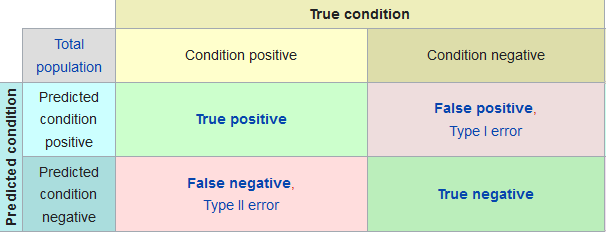
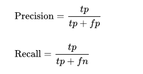

## CHAPTER 3 - Classification

### Performance Measures
- Measuring Accuracy Using Cross-Validation: Accuracy is generally not the preferred performance measure for classifiers, especially when you are dealing with skewed datasets (i.e., when some classes are much more frequent than others).
- Confusion Matrix: The general idea is to count the number of times instances of class A are classified as class B. Each row in a confusion matrix represents an actual class, while each column represents a predicted class. A perfect classifier would have only true positives and true negatives, so its confusion matrix would have nonzero values only on its main diagonal (top left to bottom right). 
- Consider a Cat vs Dog classifier. Precision (also called positive predictive value) is the fraction of relevant instances among the retrieved instances (i.e out of the images predicted as 'Cats' how many of them actually are 'Cats'), while recall (also known as sensitivity) is the fraction of the total amount of relevant instances that were actually retrieved  (i.e out of the all the actual 'Cats' images how many are predicted as 'Cats').  
 

    
  

- Increasing precision reduces recall, and vice versa. This is called the precision/recall tradeoff. You can have a 'decision threshold' which decides up to what extend you allow the precision or recall to exist in your training. So how can you decide which threshold to use? - We can take help from Scikit-learn's 'decision_function' and 'precision_recall_curve()' function to decide the threshold value. Or you can just plot precision directly against recall and decide on the threshold based on the requirement. 
    <blockquote>If someone says “let’s reach 99% precision,” you should ask, “at what recall?”</blockquote>
- The receiver operating characteristic (ROC) curve is another common tool used with binary classifiers. It is very similar to the precision/recall curve, but instead of plotting precision versus recall, the ROC curve plots the true positive rate (another name for recall) against the false positive rate. 
- Since the ROC curve is so similar to the precision/recall (or PR) curve, you may wonder how to decide which one to use. As a rule of thumb, you should prefer the PR curve whenever the positive class is rare or when you care more about the false positives than the false negatives, and the ROC curve otherwise.

**Multiclass classification:** Classification task with more than two classes. Each sample can only be labelled as one class. Ex: Classifying Cat vs Dog. An instance can only be a cat or a dog.  

**Multilabel Classification:** In some cases you may want your classifier to output multiple classes for each instance. Such a classification system that outputs multiple binary labels is called a multilabel classification system. This can be thought of as predicting properties of a sample that are not mutually exclusive. Ex: Topic labelling. One instance of text may belong to multiple topics.  

**Multioutput regression:** predicts multiple numerical properties for each sample. Each property is a numerical variable and the number of properties to be predicted for each sample is greater than or equal to 2. Ex: prediction of both wind speed and wind direction, in degrees, using data obtained at a certain location. Each sample would be data obtained at one location and both wind speed and direction would be output for each sample. 

**Multioutput-multiclass classification** (also known as multitask classification): classification task which labels each sample with a set of non-binary properties. Both the number of properties and the number of classes per property is greater than 2. A single estimator thus handles several joint classification tasks. This is both a generalization of the multilabel classification task, which only considers binary attributes, as well as a generalization of the multiclass classification task, where only one property is considered. Ex: classification of the properties “type of fruit” and “colour” for a set of images of fruit. The property “type of fruit” has the possible classes: “apple”, “pear” and “orange”. The property “colour” has the possible classes: “green”, “red”, “yellow” and “orange”. Each sample is an image of a fruit, a label is output for both properties and each label is one of the possible classes of the corresponding property.
