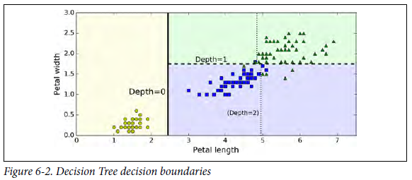
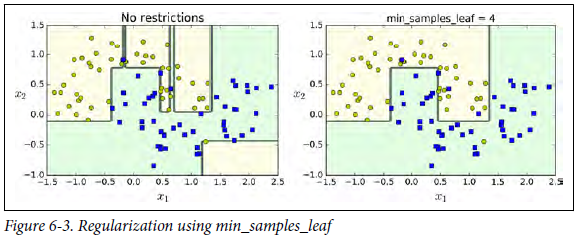

## CHAPTER 6 - Decision Trees

- Like SVMs, Decision Trees are versatile Machine Learning algorithms that can perform both classification and regression tasks, and even multioutput tasks. They are very powerful algorithms, capable of fitting complex datasets. 
- One of the many qualities of Decision Trees is that they require very little data preparation. In particular, they don’t require feature scaling or centering at all.
- A node’s samples attribute counts how many training instances it applies to. A node’s value attribute tells you how many training instances of each class this node applies to. Finally, a node’s gini attribute measures its impurity: a node is “pure” (gini=0) if all training instances it applies to belong to the same class.
- Scikit-Learn uses the CART algorithm, which produces only binary trees: nonleaf nodes always have two children (i.e., questions only have yes/no answers).
- Decision Trees are fairly intuitive and their decisions are easy to interpret. Such models are often called *white box* models. In contrast, Random Forests or neural networks are generally considered *black box* models. They make great predictions, and you can easily check the calculations that they performed to make these predictions; nevertheless, it is usually hard to explain in simple terms why the predictions were made.
- Scikit-Learn uses the Classification And Regression Tree (CART) algorithm to train Decision Trees (also called “growing” trees). The idea is really quite simple: the algorithm first splits the training set in two subsets using a single feature *k* and a threshold *tk* (e.g., “petal length ≤ 2.45 cm”). How does it choose *k* and *tk*? It searches for the pair *(k, tk)* that produces the purest subsets (weighted by their size). Once it has successfully split the training set in two, it splits the subsets using the same logic, then the sub-subsets and so on, recursively. It stops recursing once it reaches the maximum depth (defined by the max_depth hyperparameter), or if it cannot find a split that will reduce impurity. A few other hyperparameters control additional stopping conditions.  
  

### Impurity (Gini vs Entropy)
- By default, the Gini impurity measure is used, but you can select the *entropy* impurity measure instead by setting the criterion hyperparameter to "entropy". The concept of entropy originated in thermodynamics as a measure of molecular disorder: entropy approaches zero when molecules are still and well ordered. It later spread to a wide variety of domains, including Shannon’s information theory, where it measures the average information content of a message: entropy is zero when all messages are identical. In Machine Learning, it is frequently used as an impurity measure: a set’s entropy is zero when it contains instances of only one class.

### Regularization
- Decision Trees make very few assumptions about the training data (as opposed to linear models, which obviously assume that the data is linear, for example). If left unconstrained, the tree structure will adapt itself to the training data, fitting it very closely, and most likely overfitting it. Such a model is often called a nonparametric model, not because it does not have any parameters (it often has a lot) but because the number of parameters is not determined prior to training, so the model structure is free to stick closely to the data. In contrast, a parametric model such as a linear model has a predetermined number of parameters, so its degree of freedom is limited, reducing the risk of overfitting (but increasing the risk of underfitting). 
- To avoid overfitting the training data, you need to restrict the Decision Tree’s freedom during training. This is called regularization. The regularization hyperparameters depend on the algorithm used, but generally you can at least restrict the maximum depth of the Decision Tree. In Scikit-Learn, this is controlled by the max_depth hyperparameter (the default value is None, which means unlimited). Reducing max_depth will regularize the model and thus reduce the risk of overfitting.  
  

### Regression
- Decision Trees are also capable of performing regression tasks. The Decision Tree will be similar to the classification tree. The main difference is that instead of predicting a class in each node, it predicts a value.

### Instability of Decision Trees (Limitations)
1. Decision Trees love orthogonal decision boundaries (all splits are perpendicular to an axis), which makes them sensitive to training set rotation.
2. Decision Trees are very sensitive to small variations in the training data.
- Random Forests can limit this instability by averaging predictions over many trees. 
